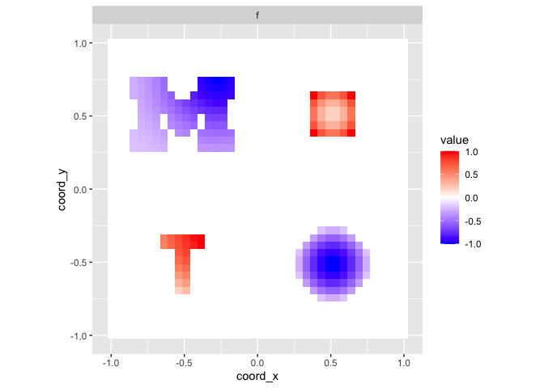
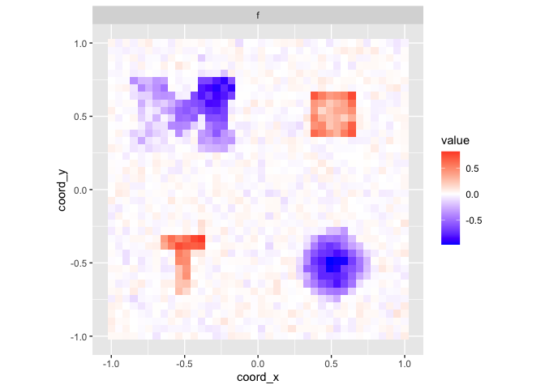

STCAR:Vignette
================
Yuliang Xu
2024-06-10

- [installation](#installation)
- [Scalar-on-image regression](#scalar-on-image-regression)
  - [generate testing case](#generate-testing-case)
  - [Run SonI model](#run-soni-model)
  - [check results](#check-results)

# installation

``` r
devtools::install_github("yuliangxu/STCAR",force = T)
```

# Scalar-on-image regression

## generate testing case

``` r
# common
library(STCAR)
q = 2
SGD_subsample_size = 200
in_scale = 1
side  = 40

n = 600
all_shape = c("circle","triangle", "square","Tshape","UMlogo")


region_idx = gen_grids_df_4region(side)
p = side*side

grids_df_loc = create_img_coords(imgdim = c(side/2, side/2))
beta_img = spatial_sparse_signals(grids_df_loc,p=1L,shape = "Tshape",
                                  effect_size=1.0,smooth=0.1,radius = 0.3)

beta_img2 = spatial_sparse_signals(grids_df_loc,p=1L,shape = "circle",
                                   effect_size=1.0,smooth=0.1,radius = 0.5)

beta_img3 = spatial_sparse_signals(grids_df_loc,p=1L,shape = "UMlogo",
                                   effect_size=1.0,smooth=1.5,radius = 0.3)
map_to_range = function(x,range=c(0,1)){
  (x-min(x))/(max(x)-min(x))*(range[2]-range[1])+range[1]
}
beta_img3$img[beta_img3$img!=0] = map_to_range(beta_img3$img[beta_img3$img!=0], range = c(0.2,1))


beta_img4 = spatial_sparse_signals(grids_df_loc,p=1L,shape = "square",
                                   effect_size=1.0,smooth=0.1,radius = 0.3)
in_beta_img = rep(0,p)
in_beta_img[region_idx[[1]]] = beta_img$img
in_beta_img[region_idx[[2]]] = - beta_img2$img
in_beta_img[region_idx[[3]]] = -beta_img3$img
in_beta_img[region_idx[[4]]] = beta_img4$img
grids_df = create_img_coords(imgdim = c(side, side))
plot_2D_funcs(in_beta_img, grids_df)
```

<!-- -->

``` r


# generate data
datsim = generate_SonI_data(in_beta_img,n,q = q,
                            sigma_C = 1,sigma_Y=0.1,
                            SNR = NULL, include_Confounder = F)
```

## Run SonI model

``` r
# CAVI --------------------------------------------------------------------

cv_model <- glmnet::cv.glmnet( cbind(datsim$M) ,datsim$Y, 
                               alpha = 0, intercept = FALSE)
y1 = glmnet::glmnet( cbind(datsim$M),datsim$Y, 
                     alpha = 0,lambda = cv_model$lambda.min,
                     intercept = FALSE) # elastic net, alpha = 0.5
init_ridge = list(beta = coef(y1)[1:p+1] + rnorm(p,sd=0.001), 
                  gamma = rep(0,q),
                  f_beta = coef(y1)[1:p+1])

in_init = init_ridge

CAR = neighbor_sparse_mat_RANN(grids_df, bandwidth = 8, rho = 0.9, scale = 1)
#> [1] "begin W creation ..."
#> ================================================================================

sigmasq_step_controls = list(a=0.5,b=1,gamma = -0.7)
SGD_control = list(step = 1e-3/2, subsample_size = 200, protect_percent = 0.5)
summary(sapply(1:2900,function(x){with(sigmasq_step_controls, a*(b+x)^gamma)}))
#>     Min.  1st Qu.   Median     Mean  3rd Qu.     Max. 
#> 0.001884 0.002304 0.003060 0.005633 0.004966 0.307786


cavi_rho = SonI_CAVI_rho(y = datsim$Y, 
                         X = t(datsim$C), 
                         M = datsim$M, 
                         update_gamma = F, 
                         include_Confounder = F,
                         lambda = 0.1, # need to be adjustable to sigma_mu (large sigma_mu <-> large lambda)
                         rho = CAR$rho, B = CAR$B,
                         W = CAR$W,
                         in_Sigma_inv = CAR$inv_Sigma,in_D = CAR$D,
                         method = "CAVI",
                         SGD_control = NULL,
                         sigmasq_step_controls=sigmasq_step_controls,
                         Geweke_controls = NULL,
                         init_paras = in_init, 
                         in_delta_rho = rep(1,p),
                         begin_f_beta = 0,
                         initial_sigma_sq = 0.1, 
                         initial_sigma_beta_sq = 0.01, # when not updating sigma_beta,need to tune this
                         initial_tau_mu_sq = 0.2, # when not updating sigma_beta,need to tune this
                         max_iter = 2000, 
                         thinning = 1,
                         f_beta_interval = 1,
                         ELBO_stop = 0, # 0 for beta_diff, 1 for ELBO diff
                         paras_diff_tol = 1e-8,
                         verbose = 100,
                         trace_all_ELBO = T,
                         display_progress = F)
#> Scalar_on_Image...1
#> Scalar on image: Loading data....
#> Scalar on image: Load data successful
#> Scalar_on_Image...2
#> Sparse mean: Loading CAR...
#> Sparse mean: Load CAR successful
#> Scalar_on_Image...3
#> Scalar on image: set initial values successful
#> Scalar_on_Image...6
#> Scalar on image: CAVI converged at iter: 434; paras_diff=9.94664e-09
#> Scalar_on_Image...7-2

CAVI = list(beta = cavi_rho$post_mean$beta,
            IP = cavi_rho$post_mean$IP,
            time = cavi_rho$elapsed,
            iter = cavi_rho$iter)
```

## check results

``` r
plot_2D_funcs(CAVI$beta, grids_df)
```

<!-- -->
